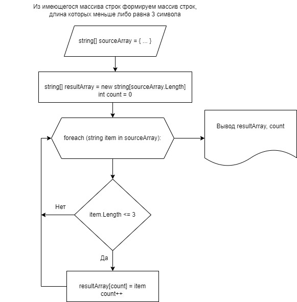

# Текстовое описание решения #

## Постановка задачи ##

Написать программу, которая из имеющегося массива строк формирует массив из строк, длина которых меньше либо равна 3 символа. Первоначальный массив можно ввести с клавиатуры либо задать на старте выполнения алгоритма. При решении не рекомендуется пользоваться коллекциями, лучше обойтись только массивами.

## Описание решения ##

Исходный массив обозначим как sourceArray, результирующий как resultArray.

Исходный массив sourceArray задаем на старте выполнения алгоритма (не вводим с клавиатуры).

Создаем результирующий массив resultArray той же размерности, что и исходный массив sourceArray.

Вводим счетчик count количества строк, пополнивших результирующий массив resultArray. Исходное присвоение счетчика: 0.

В цикле foreach пробегаемся по всем элементам-строкам item исходного массива sourceArray и проверяем условие: если длина строки меньше либо равна 3 символа, помещаем эту строку в результирующий массив (выполняем присвоение resultArray[count] = item) и инкрементируем счетчик (count++).

По завершении цикла выводим массив resultArray и количество заполненных строк count.

## Схема алгоритма ##

## Программная реализация ##

Программная реализация алгоритма на языке C# представлена в файле project/Program.cs 

